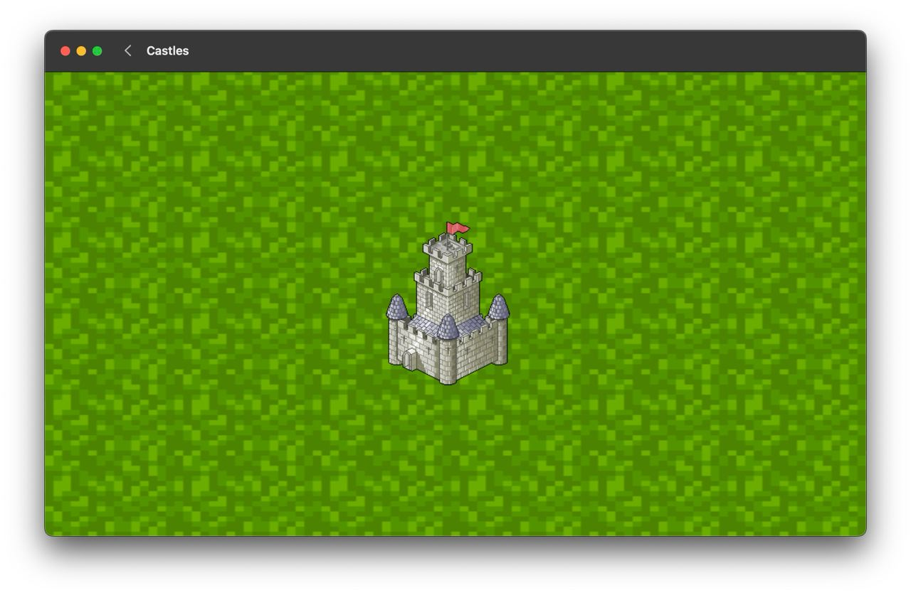

# Castles

Strategy game in which you need to build roads so as to capture all the castles.

<div style="display: flex; flex-direction: row; flex-wrap: wrap; justify-content: center; column-gap: 24px; row-gap: 20px;">
  <span></span>

</div>

## Структура проекта

```
Castles
├── CastlesGame      <- business logic
│   ├── Model
│   │   └── ...
│   ├── Repository 
│   │
│   ├── Timer 
│   │
│   └── Game 
│
│
├── CastlesGameTests <- tests for business logic
│   └── ...
│
├── Castles
│   └── (spritekit view)
│
```

## Технологии и инструменты

- [Repository Pattern]()
- [SwiftUI](https://developer.apple.com/xcode/swiftui/)
- [SpriteKit](https://developer.apple.com/spritekit/)
- [SwiftLint](https://github.com/realm/SwiftLint)
